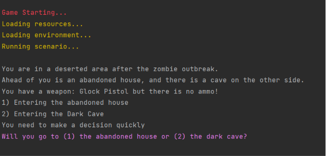

# 🧟 Zombie Survival Quiz Game

A simple **text-based adventure game** built with **Python** where players must survive a zombie apocalypse by making the right decisions and answering technology-related quiz questions.

---

## 🎮 Gameplay

You wake up in a world destroyed by a zombie outbreak.

Your mission is to survive by choosing the safest path:

* 🏚️ Enter the abandoned house
* 🌑 Explore the dark cave

Inside the cave you'll find ammunition, but defeating the zombies requires answering quiz questions correctly.

Make the right choices to survive!

---

## ✨ Features

* 🎲 Random weapon selection
* 💬 Animated text output
* 🧩 Multiple quiz questions
* ❤️ Health and score system
* 🔁 Play Again option
* 🎨 Colored terminal output
* 🐍 Pure Python (No external libraries)

---

## 📸 Screenshot

<p align="center">
  
</p>

---

## 🚀 Getting Started

### Clone the repository

```bash
git clone https://github.com/YOUR_USERNAME/Zombie-Survival-Quiz-Game.git
```

### Open the project

```bash
cd Zombie-Survival-Quiz-Game
```

### Run the game

```bash
python game.py
```

---


---

## 🛠️ Built With

* Python 3
* time
* random

---

## 💡 Future Improvements

* Multiple difficulty levels
* Inventory system
* Save & Load game
* More maps
* Different zombie types
* Sound effects
* Better combat system

---

## Contact Me

<p align="center">
  <a href="https://github.com/ahmedmubarak2010">
    
  </a>

  <a href="https://www.linkedin.com/in/ahmed-mubarak-8564aa303">
    
  </a>

  <a href="mailto:mubarakxahmed2010@gmail.com">
    
  </a>

  <a href="https://wa.me/message/45YZ4FUMDMEJN1">
    
  </a>
</p>
---

## Author

**Ahmed Mubarak**

---

## ⭐ Support

If you enjoyed this project, don't forget to leave a ⭐ on the repository.
